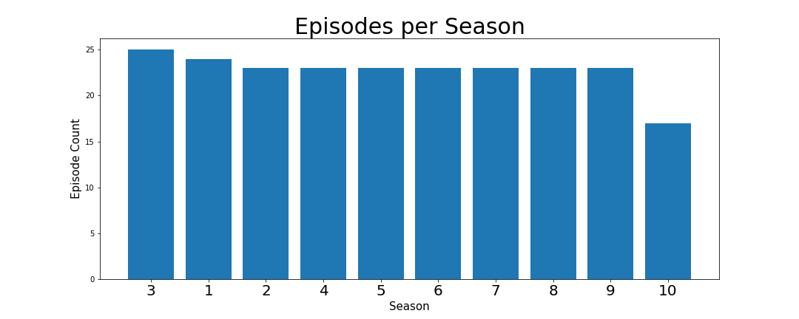
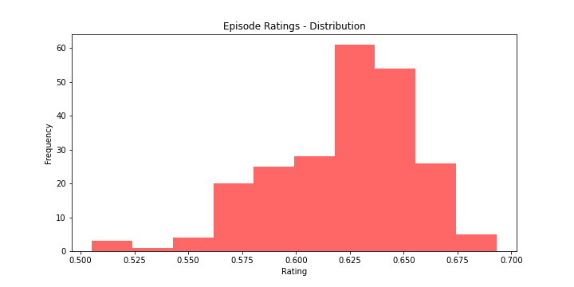
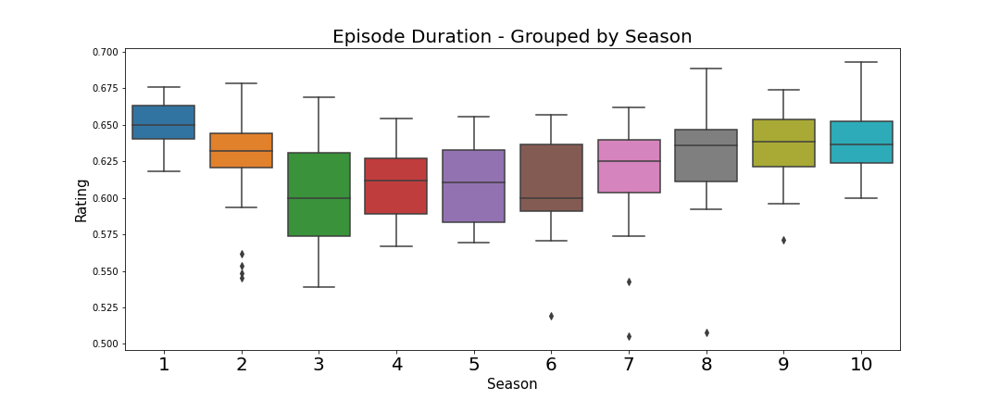
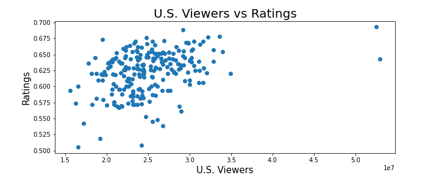

# 📒 Data Visualization - Code Out

This notebook contains **11 tasks** centered around **data visualization** using **matplotlib**📊. 


For each visualization, instructions are provided describing what customizations must be applied to the visualization in order to pass the provided tests. 

Within the instructions, a saved image of the visualization is displayed. **Your goal is to create a visualization that mirrors the displayed image.**
> *Please note:* When developing data visualizations, there are frequently judgment calls that must be made about about a number of visual settings. The provided tests in this notebook will assess many of the matplotlib settings that were used to generate the displayed visualization, but not every setting is tested. **For this notebook, and any future assessments, you should be sure to meet the required instructions *exactly*.** Outside of those settings you are free to customize your visualizations however you feel is best.

This notebook requires you use `plt.subplots` and that you assign matplotlib figure and axis variables to specific variable names.

**For example:**

Given the following prompt:


>➡️**name the figure variable `plot_first_fig`**

>➡️ **name the axis variable `plot_first_ax`.**


The correct code would be as followed:

```python
plot_first_fig, plot_first_ax = plt.subplots()
```

## Task 1 - Import pandas using the standard alias.


```python
# Your code here
```

## Task 2 - Import the pyplot module from matplotlib using the standard `plt` alias.


```python
# Your code here
```

## Task 3 - Load a csv file

A dataset called `friends_info.csv` containing information about the tv show [Friends](https://en.wikipedia.org/wiki/Friends) is saved inside the `data/` folder of this repository.

In the cell below:
- import the `friends_info` dataset using pandas
- save the resulting pandas dataframe to the variable `df`.


```python
# Your code here
```

## Task 4 - Drop all rows that contain null values


```python
# Your code here
```

## Task 5 - Using `plt.subplots` create a bar plot that visualizes the total number of episodes produced for each season. 

➡️ **name the figure variable `plot_one_fig`**

➡️ **name the axis variable `plot_one_ax`.**


This visualization should include the following customizations:
1. A figsize of (15, 6)
2. A title set to `'Episodes per Season'` with a fontsize of 30.
3. xtick labels with a fontsize of 20.
4. An xaxis label set to `'Season'` with a fontsize of 15.
5. A yaxis label set to `'Episode Count'` with a fontsize of 15.


**Below is an example of what your visualization should look like:**




```python
# Your code here
```

## Task 6 - Using `plt.subplots` visualize the number of episodes produced by the ten most frequent directors.

➡️ **name the figure variable `plot_two_fig`**

➡️ **name the axis variable `plot_two_ax`.**

This visualization should include the following customizations:

1. A title set to `'Top Ten Directors - Frequency'` with a fontsize of 35.
2. An xlabel set to `'Directors'` with a fontsize of 15.
3. A ylabel set to `'Number of films directed'` with a fontsize of 15.
4. For each xtick label, the spaces `' '` should replace with `'\n'`.

**Below is an example of what your visualization should look like:**


```python
# Your code here
```

## Task 7 - Plot a histogram for the `Rating` column.

➡️ **name the figure variable `plot_three_fig`**

➡️ **name the axis variable `plot_three_ax`.**

This visualization should include the following customizations:
1. The figsize should be set to (10,5)
2. The title should be set to `'Episode Ratings - Distribution'`
3. The xlabel should be set to `'Rating'`
4. The ylabel should be set to `'Frequency'`
5. The color should be set to `'red'`
6. The alpha should be set to `.6`

Below is an example of what your visualization should look like:




```python
# Your code here
```

## Task 8 - Visualize the average episode duration per year. 
> Because this is a time based visualization, a line plot is typically best.

➡️ **name the figure variable `plot_four_fig`**

➡️ **name the axis variable `plot_four_ax`.**

This visualization should include the following customizations:
1. The linewidth should be set to `5`.
2. The linestyle should be set to `--`.
3. The color should be set to `'green'`.
4. The title should be set to `'Average Duration - Per Year'`
5. The xlabel should be set to `'Year'`.
6. The ylabel should be set to `'Average Duration'`

**Hint:** You will need to use a groupby for this problem!

Below is an example of what your visualization should look like:

 


```python
# Your code here
```

## Task 9 - Import Seaborn using the standard `sns` alias.


```python
# Your code here
```

## Task 10 - Using seaborn's [`boxplot`](https://seaborn.pydata.org/generated/seaborn.boxplot.html), visualize the box plots for each season's Duration. 

➡️ **name the figure variable `plot_five_fig`**

➡️ **name the axis variable `plot_five_ax`.**

The visualization should have the following customizations:
1. A title set to `'Episode Duration - Grouped by Season'`
2. An xlabel set to `'Season'`
3. A ylabel set to `'Rating'`

Below is an example of what your visualization should look like:




```python
# Your code here
```

## Task 11 - Create a scatter plot

In the cell below, plot the relationship between U.S. Viewers and ratings.

➡️ **name the figure variable `plot_six_fig`**

➡️ **name the axis variable `plot_six_ax`.**

This visualization should have the following customizations:
1. A title set to `'U.S. Viewers vs Ratings'`
2. An xlabel set to `'U.S. Viewers'`
3. A ylabel set to `'Ratings'`

Below is an example of what your visualization should look like:




```python
# Your code here
```
